# Gaming Publisher Analysis: Who Dominates, How, and Why

**Analyzing 131,884 games across Steam, PlayStation, and Xbox to uncover publisher strategies, pricing models, and the structural divide between indie and major publishers.**

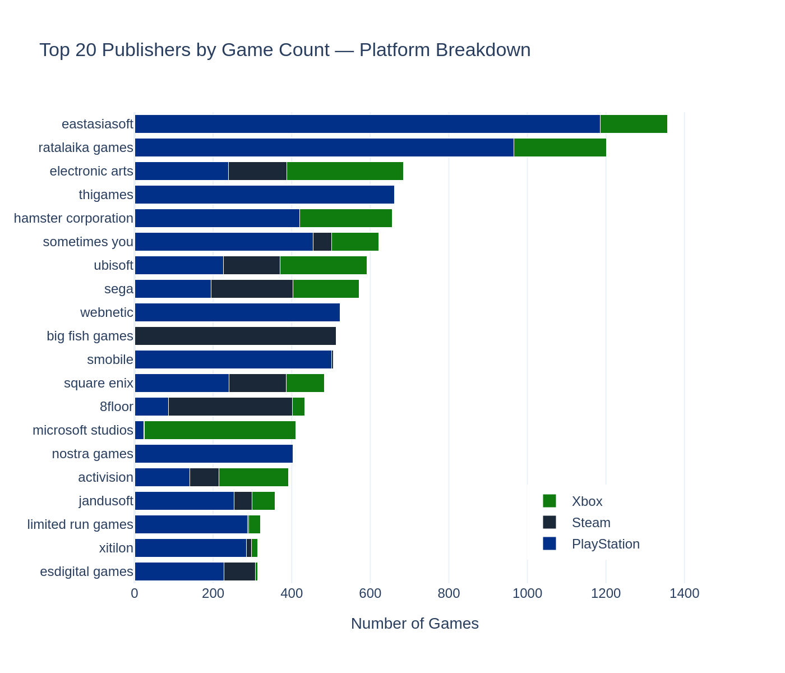

---

## Key Findings

**1. No single publisher dominates any platform.** The #1 known publisher on Steam (Big Fish Games) holds just 0.52% market share. Gaming publishing is radically fragmented.

**2. Two winning business models exist side by side.** AAA publishers (EA, Ubisoft, Sega) go tri-platform at $22-30/game. Volume publishers (Eastasiasoft, Ratalaika) flood PS/Xbox with budget titles at $2-8/game. Eastasiasoft (1,356 games) is bigger than EA (684) by raw volume.

**3. 96.6% of indie publishers are locked to a single platform** with an average of 1.5 games and $7.91 pricing. The platform gap — not price — is the clearest structural divide.

**4. The Scissors Pattern (2015-2024):** Indie publisher count grew 8.5x while prices stayed flat at ~$8. Major publishers grew output 5.7x AND raised prices 46%. The price gap doubled from $7.47 to $14.54.

**5. Each platform has a pricing personality.** Steam = 82% budget. Xbox = mid-tier dominated. PlayStation = unique volume-budget model with trophy publisher ecosystem.

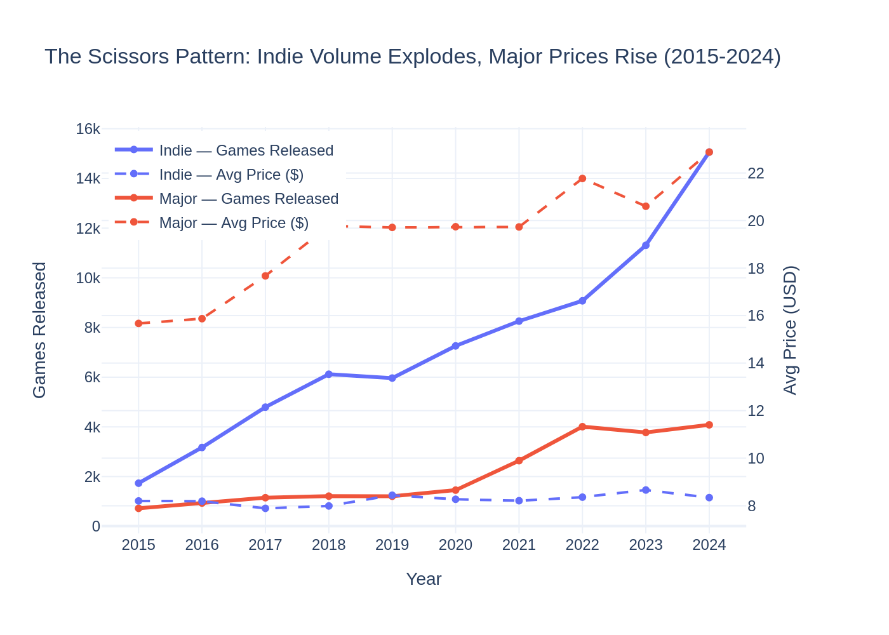

---

## Project Overview

| | |
|---|---|
| **Dataset** | Kaggle "Gaming Profiles 2025" — 60GB, 3 platforms |
| **My Scope** | Publisher Analysis (Task #5 of 6-member team project) |
| **Games Analyzed** | 131,884 across Steam (98K), PlayStation (23K), Xbox (10K) |
| **Publishers Mapped** | 51,193 unique publishers |
| **Platform** | BigQuery (SQL) → Python (Pandas/Plotly/scipy/scikit-learn) |
| **Approach** | SQL-first — 80% of analysis in BigQuery, Python for stats + viz |

---

## Methodology

### Pipeline: Bronze → Silver → Gold → Python

```
Raw CSVs ──→ Bronze (clean) ──→ Silver (join & parse) ──→ Gold (analyze) ──→ Python (stats & viz)
  3 platforms    6 tables          4 tables                 9 tables          10 charts + 3 ML models
  131,884 rows   type validation    publisher parsing        market share      t-test
                 null handling      price deduplication      pricing tiers     K-means
                 row filtering      platform unification     genre parsing     Random Forest
                                                                              Logistic Regression
```

### Bronze Layer — Clean & Validate
Uploaded raw CSVs from three platforms into BigQuery. Handled Steam's 179MB file by splitting into two uploads. Validated schemas via `INFORMATION_SCHEMA`, filtered 1 bad PS row (CSV parse error), dropped 3 titleless Steam rows (0.003%). Key decision: **NULL prices kept** — null means free-to-play or unavailable, not $0.

### Silver Layer — Unify, Join & Parse
The core engineering challenge. Four tables built in sequence:

1. **silver_unified_games** — `UNION ALL` across 3 platforms with platform tagging (131,884 rows)
2. **silver_games_with_prices** — `LEFT JOIN` with latest price per game via `ROW_NUMBER()` partitioned by gameid
3. **silver_games_publishers_parsed** — Publisher list parsing using `REGEXP_REPLACE` + `SPLIT` + `UNNEST` (137,204 rows — games with multiple publishers exploded)
4. **silver_master_publishers** — One row per publisher with aggregated metrics (51,193 publishers)

**The parsing problem:** Publisher fields stored as Python-style list strings like `['Activision']` or `["Bethesda's Studio"]` with mixed single/double quoting. A naive comma split breaks on company names containing commas (e.g., "Co., Ltd."). Solution: `REGEXP_REPLACE` converts the quote-comma-quote delimiter to a safe `|||` separator before `SPLIT`.

### Gold Layer — Deep Analysis
Seven analysis queries building 9 tables:

| # | Table | Question Answered |
|---|-------|-------------------|
| 1 | gold_market_share | Who dominates which platform, and by how much? |
| 2 | gold_platform_strategy | Do multi-platform publishers outperform single-platform ones? |
| 3 | gold_pricing_strategy | How do publishers price differently across platforms? |
| 4 | gold_publisher_genre_parsed + gold_genre_specialization | Which genres does each publisher specialize in? |
| 5 | gold_indie_vs_major | How do 49K indie publishers compare to 105 majors? |
| 6 | gold_top20_dashboard | Complete profile of the 20 largest publishers |
| 7 | gold_release_patterns | How has the market changed over time? |

**Key design decisions:**
- Publisher tiers defined by game count: major (100+), mid-tier (10-99), indie (1-9) — data-driven proxy, no external classification available
- Price tiers: budget (<$10), mid ($10-30), premium (>$30)
- Genre parsing reused the same `REGEXP_REPLACE` pattern from publisher parsing — one proven technique, two applications
- `unknown` publishers excluded from tier analysis but tracked separately as self-published segment

### Python Phase — Statistics & Visualization
Built in Google Colab with zero prior Python experience (learned in-flow during the project):

- **10 Plotly visualizations** — market share bars, platform strategy comparison, pricing distribution, genre heatmap, indie vs major divide, scissors pattern, top 20 dashboard, t-test distribution, K-means scatter, elbow method
- **Welch's t-test** — confirmed the ~$8 major-indie price gap is statistically significant (p < 0.001)
- **K-Means clustering** (K=4) — independently validated the AAA vs Volume publisher archetypes discovered in SQL

### Supervised Machine Learning

**Random Forest Classifier** — Predicts publisher tier (major/mid/indie) from average price, platform count, and genre diversity. Uses `class_weight='balanced'` to handle extreme class imbalance (49K+ indies vs ~105 majors). Feature importance reveals which observable metric is the strongest predictor of publisher scale.

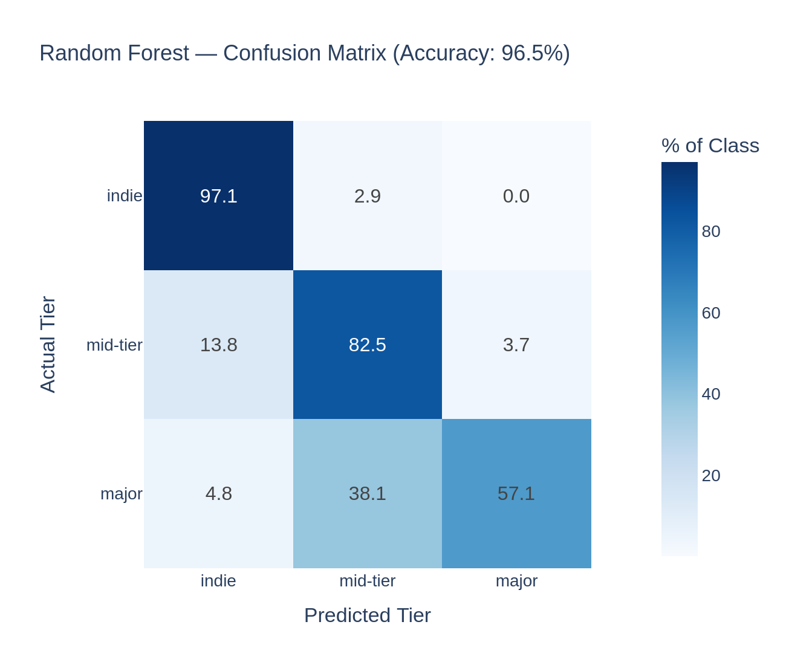
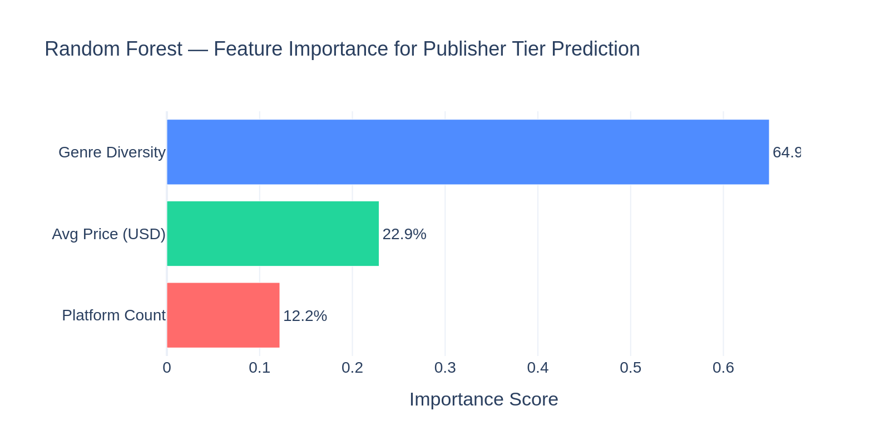

**Logistic Regression** — Predicts whether a publisher will operate on multiple platforms or stay single-platform. Features: game count, average price, genre diversity (platform count excluded to prevent data leakage). Coefficients show direction: positive pushes toward multi-platform, negative toward single.

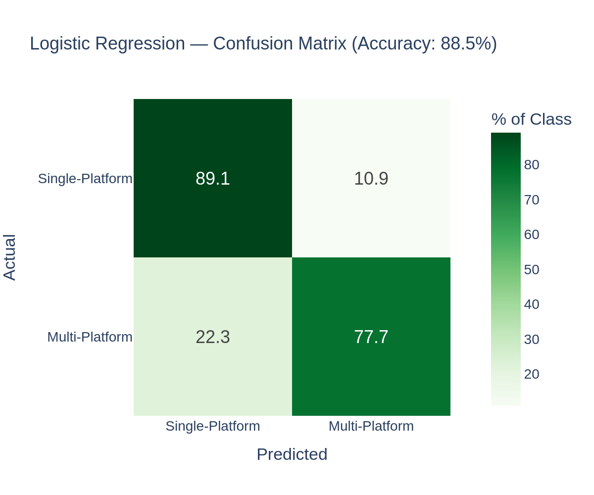
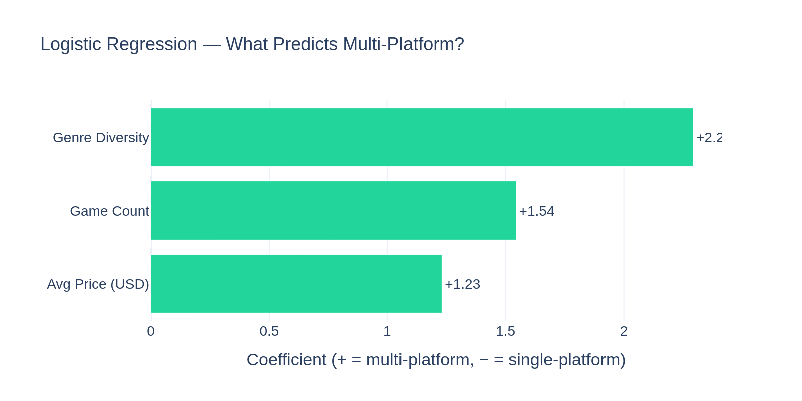

**ML Story Arc:** K-Means (unsupervised) found 4 natural publisher clusters → Random Forest (supervised) proved tiers are predictable from observable features → Logistic Regression (supervised) identified what drives the single→multi-platform transition.

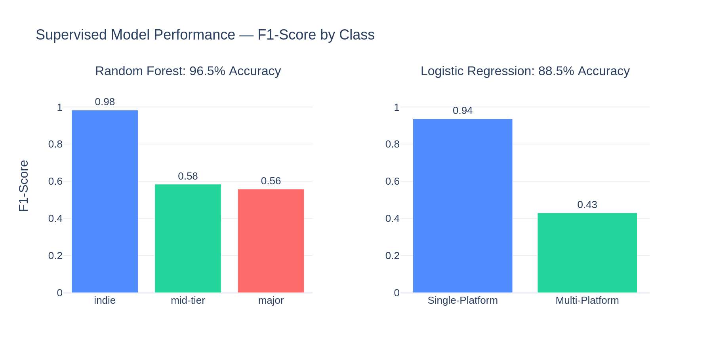

---

## Visualizations

### Market Share — No Publisher Dominates
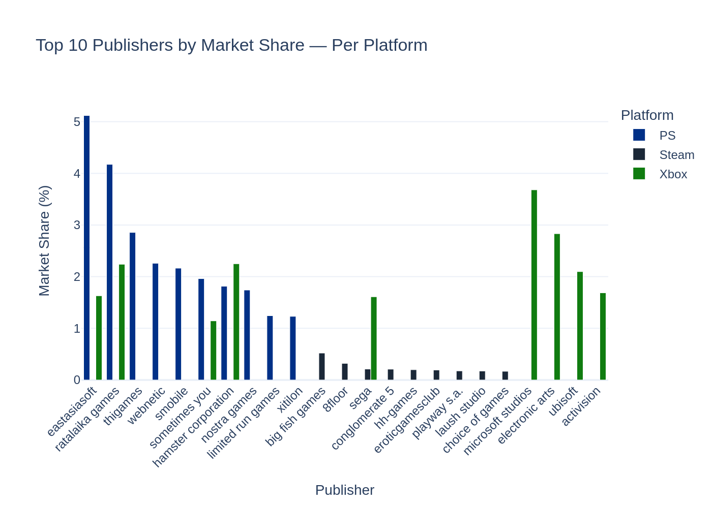

### Platform Strategy — Multi-Platform Publishers Outperform
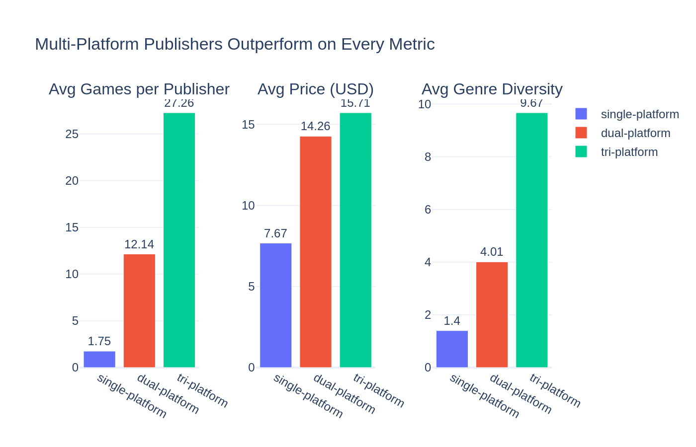

### Pricing by Platform — Each Platform Has a Personality
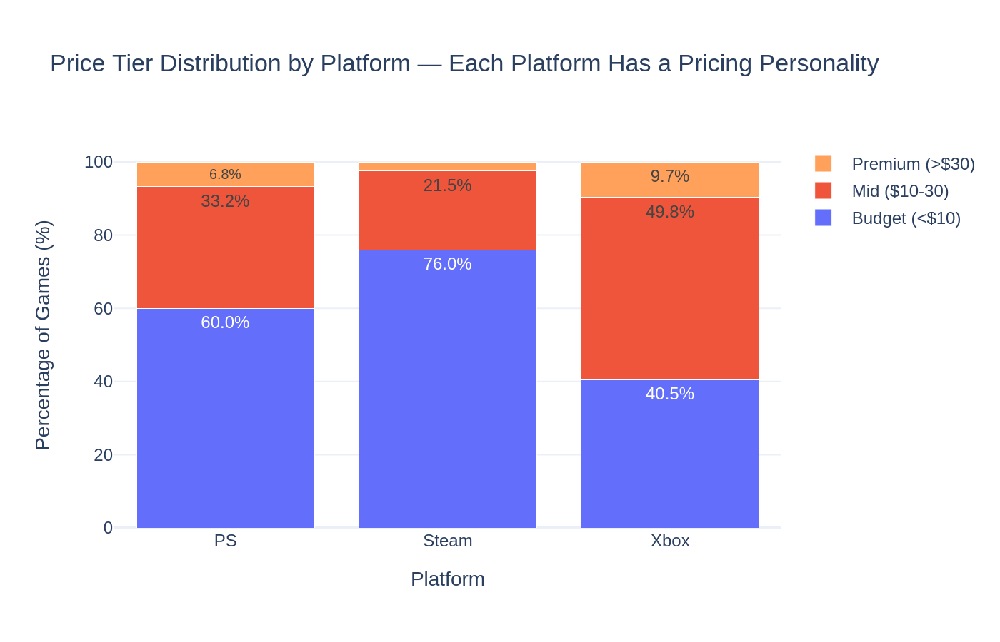

### Genre Specialization — Specialists vs Generalists
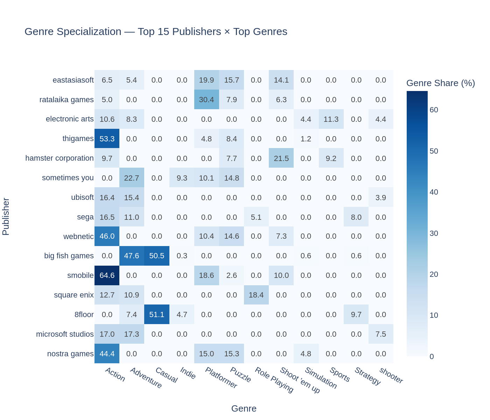

### Indie vs Major — The Structural Divide
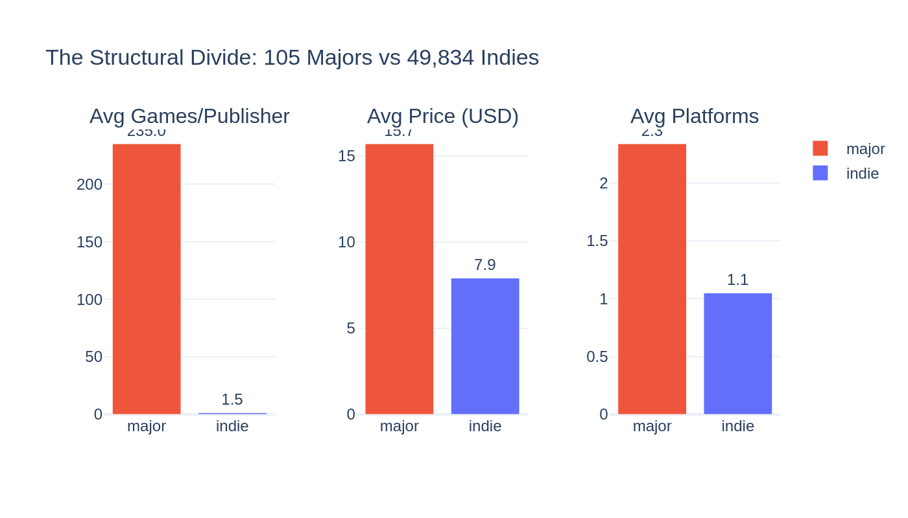

### Hypothesis Test — Price Difference is Real
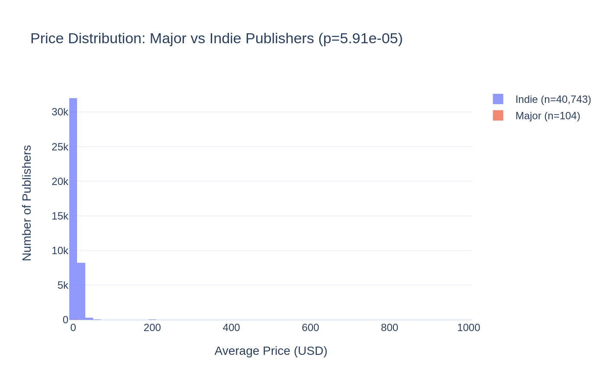

### K-Means Clustering — Two Publisher Archetypes Confirmed
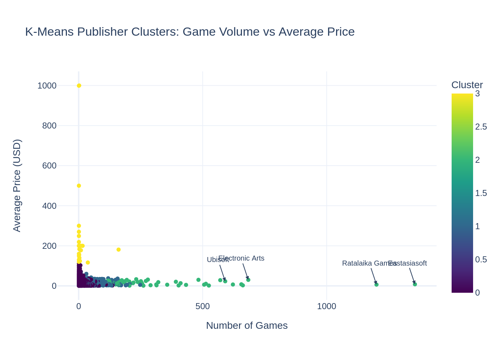

---

## Repository Structure

```
gaming-publisher-analysis/
├── README.md
├── bronze/
│   ├── 01_bronze_ps.sql
│   ├── 02_bronze_steam.sql
│   └── 03_bronze_xbox.sql
├── silver/
│   ├── 01_unified_games.sql
│   ├── 02_games_with_prices.sql
│   ├── 03_publisher_parsed.sql
│   ├── 04_master_publishers.sql
│   └── 05_validation.sql
├── gold/
│   ├── 01_market_share.sql
│   ├── 02_platform_strategy.sql
│   ├── 03_pricing_strategy.sql
│   ├── 04_genre_specialization.sql
│   ├── 05_indie_vs_major.sql
│   ├── 06_publisher_dashboard.sql
│   └── 07_release_patterns.sql
├── notebooks/
│   └── publisher_analysis.ipynb
├── charts/
│   ├── market_share_top10.png
│   ├── platform_strategy_comparison.png
│   ├── pricing_by_platform.png
│   ├── genre_heatmap.png
│   ├── indie_vs_major.png
│   ├── scissors_pattern.png
│   ├── top20_dashboard.png
│   ├── price_distribution_ttest.png
│   ├── kmeans_clusters.png
│   ├── elbow_method.png
│   ├── rf_confusion_matrix.png
│   ├── rf_feature_importance.png
│   ├── lr_confusion_matrix.png
│   ├── lr_coefficients.png
│   └── supervised_model_comparison.png
└── docs/
    └── cleaning_decisions.md
```

## How to Reproduce

1. **BigQuery:** Create a dataset in Google BigQuery. Upload raw CSVs from the [Kaggle Gaming Profiles 2025](https://www.kaggle.com/) dataset.
2. **Bronze:** Run `bronze/` SQL files in order (01→03) to create cleaned base tables.
3. **Silver:** Run `silver/` SQL files in order (01→05). File 05 is validation — run it to confirm row counts match.
4. **Gold:** Run `gold/` SQL files in order (01→07). Some queries reference other Gold tables, so order matters.
5. **Python:** Export Gold tables as CSV. Open `notebooks/publisher_analysis.ipynb` in Google Colab, upload the CSVs, and run all cells.

**BigQuery project:** `fast-archive-478610-v8` | **Dataset:** `gaming_project`

---

## Tech Stack

- **Google BigQuery** — SQL analysis, window functions, REGEXP parsing, CTEs
- **Python / Pandas** — data manipulation and aggregation
- **Plotly** — interactive, publication-quality visualizations
- **scipy.stats** — Welch's t-test for hypothesis testing
- **scikit-learn** — K-Means clustering, Random Forest classification, Logistic Regression
- **Git / GitHub** — version control with atomic commits
- **Google Colab** — notebook execution environment

---

## What I Learned

This project was my first time writing Python — I learned Pandas, Plotly, scipy, and scikit-learn inside the project itself, not from tutorials. Here's what stood out:

- **SQL-first pays off.** Doing 80% of the analysis in BigQuery before touching Python meant I only needed Python for what SQL genuinely can't do: statistical tests, ML clustering, and interactive charts. Play to your strongest skill first.

- **Edge cases at 1% silently corrupt your analysis.** The publisher parsing bug that broke on "Co., Ltd." affected ~1% of rows. If I hadn't tested on ugly data, my publisher counts would have been quietly wrong throughout every Gold query.

- **Build techniques that transfer.** The REGEXP parsing pattern I built for publishers worked identically for genres — same Python-style list format, same solution. One proven technique, two applications.

- **Tier definitions are analytical choices, not facts.** No external classification existed for "major" vs "indie" publishers. I defined thresholds (100+ / 10-99 / 1-9 games), validated them against known publishers, and documented the reasoning. Owning your definitions is part of the analysis.

- **The most surprising finding is usually the most valuable.** Eastasiasoft being bigger than EA by game count — nobody would predict that. The scissors pattern — prices diverging while volume converges — tells a story that summary statistics alone would miss.

- **Unsupervised → supervised is a powerful validation loop.** K-Means found natural clusters without labels. Random Forest proved those tiers are predictable from features. Logistic Regression identified which features drive the key business decision (single vs multi-platform). Each model answered a different question about the same data.

---

## Author

**Poi** — Data Analyst | Workintech Data Science Program

*This project is part of a 6-member team analysis of the Gaming Profiles 2025 dataset. The full team covers player behavior, game success metrics, genre trends, review sentiment, publisher strategy, and cross-cutting synthesis.*

---
